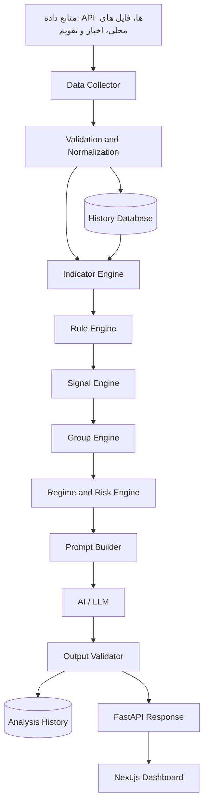
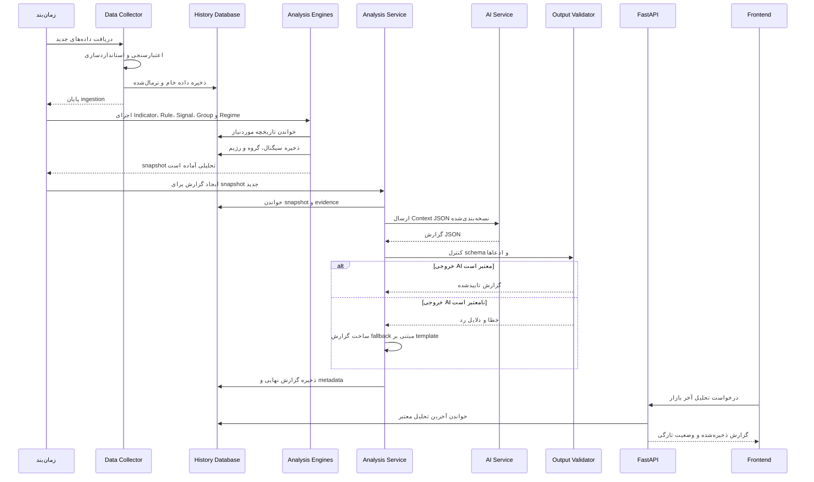

# معماری سامانه تحلیل هوشمند بازار

| مشخصه | مقدار |
| --- | --- |
| محصول | GreenPeak S&P 500 Analytics Dashboard |
| نوع سند | معماری هدف و نقشه اجرای سامانه تحلیل هوشمند بازار |
| وضعیت | پیشنهادی؛ نیازمند تایید فهرست نهایی چارت‌ها، وزن‌ها و قوانین |
| نسخه سند | 1.1 |
| آخرین بازبینی | 2026-07-30 |

## 1. هدف سند

این سند معماری هدف برای افزودن یک سامانه تحلیل بازار مبتنی بر داده و AI به داشبورد GreenPeak را تعریف می‌کند. سامانه باید داده‌های حدود ۳۰ چارت، ۱۳ گروه تحلیلی، اخبار و تقویم اقتصادی را به تحلیل قابل‌ردیابی، قابل‌تست و قابل‌ارائه تبدیل کند.

اصل محوری معماری:

> **پایتون داده را جمع‌آوری، اعتبارسنجی، محاسبه و امتیازدهی می‌کند؛ مدل زبانی فقط نتایج محاسبه‌شده را توضیح می‌دهد و گزارش می‌نویسد.**

این سیستم ابزار تحلیل اطلاعاتی است و خروجی آن نباید توصیه قطعی خرید، فروش یا تضمین بازده تلقی شود.

---

## 2. وضعیت فعلی و معماری هدف

این سند **معماری هدف** را تعریف می‌کند و نباید به‌عنوان توصیف قابلیت‌های پیاده‌سازی‌شده فعلی خوانده شود.

وضعیت قابل مشاهده در کد فعلی:

- Frontend هر ۱۳ گروه تحلیلی را در مسیرهای `/analytics/...` تعریف کرده است.
- FastAPI در حال حاضر routerهای `system`، `market`، `monetary`، `economic`، `systemrisk`، `liquidity`، `macroeco`، `corporate`، `valuation` و `sectors` را زیر `/api/v1` mount می‌کند.
- فایل endpoint مربوط به تقویم و خبر وجود دارد، اما در وضعیت فعلی در `endpoints/__init__.py` صادر و در `main.py` mount نشده است.
- داده Intermarket فعلی از routeهای داخلی Next.js زیر `/api/intermarket/...` استفاده می‌کند و قرارداد آن از FastAPI جداست.
- برخی گروه‌ها در Sidebar با وضعیت `comingSoon` نمایش داده می‌شوند؛ وجود صفحه یا component به معنی تکمیل pipeline داده و تحلیل آن گروه نیست.
- موتورهای مشترک Signal، Group، Regime، Prompt و Output Validation که در این سند آمده‌اند، اجزای معماری هدف هستند.

بنابراین اجرای این طرح باید ضمن حفظ مصرف‌کنندگان فعلی، به‌تدریج قراردادهای پراکنده را به ورودی استاندارد موتور تحلیل تبدیل کند.

---

## 3. دامنه، گروه‌ها و خروجی نهایی

### ۱۳ گروه رسمی محصول

نام فنی هر گروه باید در کل Backend، Database، Prompt و Frontend ثابت باشد.

| ردیف | شناسه فنی پیشنهادی | عنوان محصول | مسیر فعلی Frontend |
| --- | --- | --- | --- |
| 1 | `monetary_policy` | Monetary Policy | `/analytics/monetary-policy` |
| 2 | `systemic_risk` | Systemic Risk | `/analytics/systemic-risk` |
| 3 | `liquidity_flows` | Liquidity Flows | `/analytics/liquidity-flows` |
| 4 | `macroeconomic` | Macroeconomic | `/analytics/macroeconomic` |
| 5 | `corporate_earnings` | Corporate Earnings | `/analytics/corporate-earnings` |
| 6 | `valuation` | Valuation | `/analytics/valuation` |
| 7 | `sector_performance` | Sector Performance | `/analytics/sector-performance` |
| 8 | `derivatives` | Derivatives | `/analytics/derivatives` |
| 9 | `market_internals` | Market Internals | `/analytics/market-internals` |
| 10 | `intermarket` | Intermarket | `/analytics/intermarket` |
| 11 | `sentiment` | Sentiment | `/analytics/sentiment` |
| 12 | `macro_calendar_news` | Macro Calendar & News | `/analytics/macro-calendar` |
| 13 | `institutional` | Institutional | `/analytics/institutional` |

> فهرست دقیق ۳۰ چارت و نگاشت آن‌ها به این گروه‌ها باید در فاز صفر از روی صفحات و منابع واقعی تایید شود. تعداد componentها یا endpointها لزوماً با تعداد چارت‌های تحلیلی برابر نیست.

### ورودی‌ها

- داده سری‌زمانی و آخرین مقدار چارت‌ها: قیمت، حجم، VIX، نرخ‌ها، breadth، جریان نقدینگی، valuation و سایر داده‌های فعلی داشبورد.
- داده‌های بیرونی مجاز: مانند FRED، تامین‌کنندگان قیمت و سرویس اخبار.
- اخبار ساخت‌یافته: عنوان، منبع، زمان انتشار، دارایی/موضوع مرتبط و احساس خبر.
- تقویم اقتصادی: رویداد، زمان، اهمیت، مقدار قبلی، اجماع و مقدار اعلام‌شده (پس از انتشار).

### خروجی‌ها

- وضعیت هر چارت و هر گروه تحلیلی: جهت، امتیاز، شدت، اطمینان و شواهد.
- رژیم بازار (Market Regime): مانند `risk_on`، `risk_off`، `late_cycle`، `liquidity_stress`، `disinflationary_growth` یا `mixed`.
- گزارش AI شامل روایت بازار، عوامل حمایتی و ریسک، سناریوی پایه/صعودی/نزولی، تضادهای داده‌ای و سطح اطمینان.
- پاسخ API پایدار برای نمایش در Frontend و امکان مراجعه به تاریخچه تحلیل‌ها.

---

## 4. نمای کلان معماری



### مسیر اصلی داده

1. داده از APIها، منابع محلی و سرویس‌های خبر/تقویم دریافت می‌شود.
2. داده پیش از ذخیره و محاسبه اعتبارسنجی و استاندارد می‌شود.
3. تاریخچه داده خام و داده استاندارد شده نگهداری می‌شود.
4. اندیکاتورها و ویژگی‌های عددی محاسبه می‌شوند.
5. قوانین شفاف، ویژگی‌ها را به نتیجه‌های تحلیلی تبدیل می‌کنند.
6. همه نتایج در قالب سیگنال مشترک قرار می‌گیرند.
7. سیگنال‌های هر گروه و سپس کل بازار جمع‌بندی می‌شوند.
8. یک بسته داده محدود و ساخت‌یافته برای AI آماده می‌شود.
9. AI گزارش را تولید می‌کند؛ سپس خروجی آن از نظر ساختار، منبع و ادعا کنترل می‌شود.
10. خروجی تاییدشده در API، داشبورد و تاریخچه در دسترس قرار می‌گیرد.

---

## 5. مسئولیت لایه‌ها

| لایه | مسئولیت | ورودی | خروجی | نباید انجام دهد |
| --- | --- | --- | --- | --- |
| Data Collector | دریافت داده از منبع و ثبت زمان دریافت | API، CSV/XLS/XLSX، خبر، تقویم | داده خام با metadata | محاسبه اندیکاتور یا نتیجه‌گیری بازار |
| Validation and Normalization | کنترل کیفیت و یکسان‌سازی قرارداد داده | داده خام | داده معتبر و استاندارد | حدس‌زدن یا پرکردن خاموش داده مالی |
| History Database | نگهداری داده خام، نرمال‌شده و نتایج تحلیلی | داده و تحلیل زمان‌دار | تاریخچه قابل بازیابی | منطق کسب‌وکار |
| Indicator Engine | محاسبه ویژگی‌های عددی | سری‌زمانی معتبر | RSI، EMA، MACD، بازده، Z-score و ... | نوشتن روایت یا توصیه |
| Rule Engine | اعمال قوانین نسخه‌بندی‌شده | اندیکاتورها و داده زمینه‌ای | Rule Result | تماس مستقیم با AI |
| Signal Engine | تبدیل Rule Result به قرارداد یکسان | خروجی قوانین | Signal استاندارد | وزن‌دهی نهایی گروه بدون تعریف رسمی |
| Group Engine | خلاصه‌سازی سیگنال‌های یک گروه | سیگنال‌های چارت‌ها | Group Summary | تشخیص رژیم کل بازار به‌تنهایی |
| Regime and Risk Engine | تشخیص فاز بازار و ریسک‌های کلیدی | خلاصه ۱۳ گروه، تقویم، خبر | Regime Summary و Risk Summary | تولید متن آزاد بلند |
| Prompt Builder | ساخت Context محدود، دقیق و دارای شواهد | نتایج محاسباتی | AI Input JSON | ارسال داده خام غیرضروری یا secret |
| AI / LLM | تفسیر و تولید گزارش طبق schema | AI Input JSON | گزارش ساخت‌یافته | محاسبه، ساختن داده یا صدور دستور معاملاتی |
| Output Validator | کنترل schema، منبع ادعا و ایمنی متن | پاسخ AI | گزارش قابل انتشار | تغییر خاموش اعداد یا شواهد |
| API and Frontend | ارائه، نمایش و تاریخچه | گزارش تاییدشده | تجربه کاربر | اجرای محاسبات تحلیلی سنگین در مرورگر |

---

## 6. قرارداد داده استاندارد

تمام لایه‌های تحلیلی باید شناسه، زمان، منبع، بازه زمانی و وضعیت کیفیت داده را حفظ کنند. زمان‌ها در backend به UTC ذخیره و در Frontend به منطقه زمانی کاربر نمایش داده شوند.

### 6.1 داده استاندارد یک مشاهده

```json
{
  "series_id": "vix_close",
  "timestamp": "2026-07-30T20:00:00Z",
  "value": 17.42,
  "unit": "index_points",
  "frequency": "daily",
  "source": "provider_name",
  "source_updated_at": "2026-07-30T20:05:00Z",
  "quality": "valid"
}
```

مقادیر `quality`: `valid`، `stale`، `missing`، `invalid` و `estimated`. مقدار `estimated` فقط با اعلام صریح منبع و روش مجاز است؛ داده بازار نباید جعل شود.

### 6.2 قرارداد سیگنال یک چارت

```json
{
  "signal_id": "derivatives.vix_term_structure",
  "chart_id": "vix_term_structure",
  "group": "derivatives",
  "as_of": "2026-07-30T20:00:00Z",
  "signal": "risk_off",
  "direction": "bearish",
  "score": -0.7,
  "strength": "high",
  "confidence": 0.82,
  "timeframe": "daily",
  "evidence": [
    "short_term_vix_above_long_term_vix",
    "term_structure_inverted"
  ],
  "data_quality": "valid",
  "rule_version": "1.0.0"
}
```

قواعد قرارداد:

- `score` همیشه بین `-1` تا `1` است؛ منفی یعنی فشار نزولی/دفاعی و مثبت یعنی حمایت صعودی/ریسک‌پذیری.
- `confidence` بین `0` تا `1` است و به کیفیت، تازگی، سازگاری و پوشش داده وابسته است.
- `evidence` باید شناسه قابل‌ردیابی قانون یا مشاهده باشد، نه جمله مبهم.
- عدم وجود داده با صفر یا خنثی اشتباه گرفته نمی‌شود؛ باید صریحاً با `data_quality` نشان داده شود.

### 6.3 قرارداد خلاصه گروه

```json
{
  "group": "liquidity",
  "as_of": "2026-07-30T20:00:00Z",
  "bias": "slightly_bullish",
  "score": 0.35,
  "confidence": 0.71,
  "coverage": 0.88,
  "key_signals": ["liquidity.net_liquidity", "liquidity.sofr_stress"],
  "risks": ["event.fomc"],
  "conflicts": []
}
```

`coverage` درصد وزن چارت‌های دارای داده معتبر را نشان می‌دهد. اگر coverage پایین‌تر از حد مشخص باشد، گروه نباید با اطمینان بالا گزارش شود.

### 6.4 قرارداد بسته ورودی AI

```json
{
  "analysis_id": "uuid",
  "as_of": "2026-07-30T20:00:00Z",
  "market_regime": {"name": "disinflationary_growth", "confidence": 0.68},
  "group_summaries": [],
  "top_supporting_evidence": [],
  "top_risks": [],
  "conflicts": [],
  "calendar_events": [],
  "news_summary": [],
  "data_quality_summary": {},
  "output_language": "fa"
}
```

---

## 7. طراحی موتورهای تحلیلی

### 7.1 Indicator Engine

برای هر chart یک ماژول مشخص تعریف شود. محاسبات باید deterministic، قابل‌تست و مستقل از AI باشند.

نمونه محاسبات:

- روند و مومنتوم: بازده دوره‌ای، SMA/EMA، RSI، MACD، شیب روند.
- نوسان و ریسک: realized volatility، VIX، ساختار سررسید، drawdown.
- آماری: percentiles، Z-score، انحراف از میانگین، correlation و dispersion.
- پهنای بازار: advance/decline، درصد سهام بالای میانگین متحرک، new highs/lows.
- نقدینگی و نرخ‌ها: تغییرات بازده، منحنی نرخ، SOFR، DFF و شاخص‌های نقدینگی موجود.
- بنیادی و ارزش‌گذاری: نسبت‌ها، earnings revisions و انحراف از تاریخچه در صورت وجود داده معتبر.

تمام محاسبات باید `lookback_window`، `frequency` و زمان آخرین مشاهده را در خروجی ثبت کنند.

### 7.2 Rule Engine

قوانین در کد یا فایل تنظیمات نسخه‌بندی‌شده نگهداری شوند؛ متن آزاد AI محل تعریف قانون نیست.

نمونه قانون:

```text
اگر RSI روزانه بزرگ‌تر از 70 باشد:
  signal = overbought
  score = -0.30
  confidence = وابسته به کیفیت داده و تداوم وضعیت
```

نمونه قانون چندمتغیره:

```text
اگر VIX صعودی باشد و breadth نزولی باشد:
  signal = risk_off
  score = -0.70
  confidence = 0.80، مشروط به داده معتبر هر دو ورودی
```

هر قانون باید دارای `rule_id`، نسخه، شرح، منبع داده، پیش‌شرط کیفیت، روش امتیازدهی و تست باشد.

### 7.3 Signal Engine

این لایه تفاوت میان چارت‌ها را پنهان می‌کند و همه نتایج را به قرارداد سیگنال تبدیل می‌کند. نتیجه آن است که Group Engine با یک فرمت کار می‌کند، نه با ۳۰ ساختار متفاوت.

### 7.4 Group Engine

برای ۱۳ گروه یک فایل پیکربندی وزن لازم است. وزن‌ها باید قابل تغییر بدون ویرایش منطق اصلی باشند.

فرمول پیشنهادی:

```text
group_score = sum(signal_score × chart_weight × data_quality_weight) / sum(weights_of_valid_signals)
group_confidence = coverage × average(signal_confidence) × consistency_factor
```

شناسه گروه‌ها باید دقیقاً از جدول «۱۳ گروه رسمی محصول» استفاده کند. برای جلوگیری از شمردن دوباره یک مفهوم، هر chart فقط یک `primary_group` دارد؛ در صورت نیاز می‌تواند `related_groups` داشته باشد، اما امتیاز آن تنها در گروه اصلی وارد محاسبه می‌شود.

### 7.5 Regime and Risk Engine

این موتور بر مبنای امتیاز گروه‌ها، پوشش داده، تضادها و رویدادهای نزدیک، یک یا چند رژیم محتمل تعیین می‌کند.

قواعد کلیدی:

- رژیم باید همراه با `confidence` و شواهد ثبت شود.
- اگر تضاد معنادار یا coverage پایین وجود دارد، خروجی `mixed` یا `insufficient_data` مجاز و ترجیح‌داده‌شده است.
- تقویم اقتصادی می‌تواند confidence را کاهش دهد یا برچسب `event_driven_uncertainty` اضافه کند، اما نباید بدون داده عددی جهت بازار را تعیین کند.
- خبرها نقش context و catalyst دارند؛ خبر نباید جای سیگنال کمی را بگیرد مگر روش امتیازدهی آن مشخص و آزمایش شده باشد.

---

## 8. خبر و تقویم اقتصادی

### اخبار

برای هر خبر ذخیره شود: `id`، عنوان، URL، منبع، زمان انتشار، موضوع‌ها، دارایی‌ها/گروه‌های مرتبط، sentiment، اهمیت و زمان دریافت. خبر تکراری با URL یا fingerprint حذف شود.

### تقویم

برای هر رویداد ذخیره شود: `event_id`، کشور/منطقه، زمان UTC، درجه اهمیت، مقدار قبلی، اجماع، مقدار اعلام‌شده و وضعیت انتشار.

تقویم باید به دو شکل به موتور ریسک وارد شود:

- **پیش از رویداد:** افزایش عدم‌قطعیت و نمایش کاتالیزور نزدیک.
- **پس از رویداد:** مقایسه actual با consensus و بررسی واکنش بازار؛ نه صرفاً خوب/بد بودن عدد.

---

## 9. طراحی Prompt و مسئولیت AI

### System Prompt: قوانین ثابت

System Prompt باید مدل را ملزم کند که:

- فقط از داده داخل JSON استفاده کند و برای ادعا به evidence اشاره کند.
- داده گم‌شده را صریحاً اعلام کند، نه اینکه آن را حدس بزند.
- بین واقعیت، تفسیر و سناریو تمایز بگذارد.
- توصیه قطعی معامله، تضمین سود یا قیمت‌هدف بی‌پشتوانه ندهد.
- خروجی را فقط در schema درخواستی برگرداند.
- اگر تضاد داده‌ای وجود دارد، آن را در بخش مستقل گزارش کند.

### User Prompt: داده متغیر

Prompt Builder فقط بسته ورودی AI را ارسال می‌کند: رژیم، خلاصه گروه‌ها، چند evidence مهم، ریسک‌ها، رویدادهای تقویم، خلاصه خبرها و کیفیت داده. سری‌های خام بلند، کلیدهای API، تنظیمات داخلی و داده نامرتبط نباید ارسال شوند.

### Schema خروجی AI

```json
{
  "headline": "رشد محتاطانه با ریسک رویدادهای کلان",
  "market_bias": "slightly_bullish",
  "regime_interpretation": "...",
  "supporting_factors": [],
  "key_risks": [],
  "data_conflicts": [],
  "scenarios": {
    "bull": {"conditions": [], "implication": "..."},
    "base": {"conditions": [], "implication": "..."},
    "bear": {"conditions": [], "implication": "..."}
  },
  "calendar_watchlist": [],
  "confidence": 0.68,
  "limitations": []
}
```

### Output Validator

پیش از انتشار پاسخ AI موارد زیر کنترل شود:

- تطبیق کامل با JSON schema.
- عدد confidence در بازه مجاز.
- وجود evidence برای هر ادعای مهم.
- نبود ادعای قیمت، آمار یا منبعی که در Context نیست.
- نبود متن ممنوع یا توصیه قطعی سرمایه‌گذاری.
- ثبت خطا و امکان fallback به گزارش مبتنی بر template در صورت شکست AI.

---

## 10. گردش اجرای تحلیل



در مسیر دستی، `POST /analysis/run` فقط یک job ایجاد می‌کند. اجرای Collector، Engine و AI نباید داخل چرخه HTTP طولانی یا با refresh صفحه انجام شود. Frontend با `job_id` وضعیت را بررسی می‌کند و پس از تکمیل، نتیجه ذخیره‌شده را می‌خواند.

### زمان‌بندی پیشنهادی

- داده‌های intraday: فقط برای چارت‌هایی که منبع و نیاز محصول دارند، با نرخ مجاز API.
- داده‌های روزانه: پس از بسته‌شدن بازار یا در زمان مشخص.
- تقویم: حداقل روزانه و نزدیک رویدادهای مهم با بازخوانی بیشتر.
- اخبار: در بازه کوتاه و با deduplication.
- تحلیل AI: با درخواست کاربر، پس از تغییر معنادار سیگنال‌ها، یا طبق برنامه روزانه؛ نه برای هر refresh صفحه.

---

## 11. محل قرارگیری در کد فعلی

Backend فعلی FastAPI در `backend2/src/` قرار دارد. ساختار پیشنهادی بدون برهم زدن router/service موجود:

```text
backend2/src/
  api/v1/endpoints/
    analysis.py                 # endpoint های تحلیل بازار
  services/
    market_analysis_service.py  # orchestration درخواست تحلیل
  ai_market/
    collectors/
    normalizers/
    indicators/
    rules/
    engines/
    prompts/
    validators/
    schemas/
    repositories/
    config/
```

Frontend فقط از endpoint تحلیل استفاده می‌کند و نمایش‌دهنده نتیجه است. نقشه endpoint مرکزی Frontend در `front2/api/api.js` پس از نهایی شدن API به‌روزرسانی می‌شود.

### API پیشنهادی

| Endpoint | هدف |
| --- | --- |
| `GET /api/v1/analysis/latest` | آخرین تحلیل تاییدشده بازار |
| `GET /api/v1/analysis/history` | تاریخچه با فیلتر بازه زمانی |
| `GET /api/v1/analysis/signals` | سیگنال‌های چارت/گروه برای drill-down |
| `POST /api/v1/analysis/run` | درخواست اجرای تحلیل؛ فقط برای نقش مجاز و ترجیحاً با پاسخ `202 Accepted` |
| `GET /api/v1/analysis/jobs/{job_id}` | وضعیت اجرای دستی: queued، running، completed یا failed |
| `GET /api/v1/analysis/health` | وضعیت تازگی داده، پوشش و سرویس AI |

Responseها باید الگوی رایج backend یعنی `{ "data": ..., "metadata": ... }` را حفظ کنند.

### قواعد API

- `GET`ها فقط داده ذخیره‌شده را می‌خوانند و side effect ندارند.
- `POST /run` با یک `idempotency_key` از ایجاد job تکراری جلوگیری می‌کند.
- `metadata` حداقل شامل `analysis_id`، `as_of`، `generated_at`، `freshness`، `rule_version`، `prompt_version` و `model_version` است.
- پارامترهای تاریخ از قالب `YYYY-MM-DD` رایج پروژه پیروی می‌کنند.
- جزئیات خطای provider یا متن prompt به Frontend نشت نمی‌کند.

---

## 12. ذخیره‌سازی و تاریخچه

MongoDB منبع اصلی persistence است و فایل‌های داده فعلی در `backend2/src/data/raw/` نقش fallback دارند. پیشنهاد می‌شود collectionهای زیر به‌صورت جدا نگهداری شوند:

| Collection | محتوا | شاخص‌های مهم |
| --- | --- | --- |
| `market_observations` | داده استاندارد شده سری‌زمانی | `series_id + timestamp` یکتا |
| `raw_ingestions` | داده خام و نتیجه دریافت | `source + received_at` |
| `computed_indicators` | خروجی اندیکاتورها | `indicator_id + as_of` |
| `market_signals` | سیگنال چارت‌ها | `signal_id + as_of` |
| `group_summaries` | جمع‌بندی ۱۳ گروه | `group + as_of` |
| `market_regimes` | رژیم و ریسک بازار | `as_of` |
| `news_items` | اخبار deduplicated | `source + external_id` یا fingerprint |
| `calendar_events` | رویدادهای اقتصادی | `provider_event_id` |
| `ai_analyses` | گزارش، prompt version و context hash | `analysis_id + as_of` |

نسخه rule، نسخه prompt، نسخه مدل و `context_hash` باید همراه هر تحلیل AI ذخیره شود تا بتوان پاسخ گذشته را بازتولید و بررسی کرد.

---

## 13. کیفیت، خطا و قابلیت مشاهده

### حالت‌های خطا

| وضعیت | رفتار سامانه |
| --- | --- |
| API منبع قطع است | آخرین داده معتبر را با برچسب `stale` نمایش دهد؛ داده ساختگی تولید نکند. |
| MongoDB در دسترس نیست | برای سرویس‌هایی که fallback دارند از فایل‌های محلی استفاده شود؛ وضعیت degraded ثبت شود. |
| داده ناقص است | coverage و confidence کاهش یابد؛ تحلیل با محدودیت صریح یا عدم تولید گزارش. |
| AI پاسخ نامعتبر می‌دهد | پاسخ رد شود و گزارش template-based از نتایج Rule/Regime بازگردد. |
| نرخ API بیش از حد است | صف، cache و retry با backoff استفاده شود؛ از loop درخواست جلوگیری شود. |

### معیارهای سلامت

- تازگی هر source و آخرین موفقیت collector.
- درصد coverage هر گروه.
- تعداد قوانین اجراشده، خطادار و skipped.
- زمان اجرای pipeline و هزینه/تعداد فراخوانی AI.
- نرخ ردشدن پاسخ AI توسط validator.
- اختلاف تحلیل فعلی با تحلیل پیشین و دلیل آن.

---

## 14. امنیت و کنترل دسترسی

- کلیدهای API فقط در `.env` و تنظیمات محیط اجرا نگهداری شوند؛ هرگز در log، prompt یا پاسخ API نروند.
- endpoint اجرای دستی و مشاهده داده خام باید نقش‌محور باشد.
- URL خبرها و داده بیرونی پیش از ذخیره/نمایش validate شوند.
- prompt injection در خبرها محتمل است؛ متن خبر صرفاً داده مرجع است و نباید بتواند دستورهای System Prompt را تغییر دهد.
- درخواست‌های AI rate limit و audit log داشته باشند.
- گزارش‌ها، نسخه مدل و کاربر/سیستم آغازکننده اجرا برای ممیزی ثبت شوند.

---

## 15. الزامات غیرعملکردی

- **تکرارپذیری:** یک snapshot یکسان با نسخه یکسان قوانین باید Signal و Regime یکسان تولید کند.
- **Idempotency:** اجرای دوباره یک ingestion یا analysis با شناسه یکسان نباید رکورد مالی تکراری بسازد.
- **تازگی:** هر series و گروه باید SLA تازگی مستقل داشته باشد؛ داده روزانه با داده intraday یک معیار مشترک ندارد.
- **کارایی:** refresh صفحه نباید pipeline کامل یا فراخوانی AI جدید ایجاد کند؛ نتیجه آخر از cache/database خوانده شود.
- **تاب‌آوری:** اختلال یک منبع نباید همه گروه‌ها را متوقف کند؛ وضعیت گروه متاثر به‌صورت degraded گزارش شود.
- **قابلیت توضیح:** هر Group Score و Regime باید تا signal، rule و observation منبع قابل drill-down باشد.
- **کنترل هزینه:** تعداد token، مدل، latency و هزینه تقریبی هر فراخوانی AI ثبت و محدود شود.
- **زبان:** اعداد، شناسه‌ها و evidence مستقل از زبان باشند؛ فقط لایه گزارش برای فارسی/انگلیسی تغییر کند.

---

## 16. راهبرد تست و ارزیابی

### تست‌های داده و محاسبات

- Unit test برای normalizer، هر indicator و مرزهای قوانین.
- تست داده ناقص، تاریخ نامعتبر، مقدار تکراری، تقسیم بر صفر و سری کوتاه‌تر از lookback.
- Golden test: یک snapshot ثابت باید خروجی Signal، Group و Regime مورد انتظار را تولید کند.
- تست timezone و ترتیب زمانی برای جلوگیری از look-ahead bias.

### تست‌های AI

- Schema validation برای همه خروجی‌ها.
- مجموعه سناریوهای ثابت شامل بازار صعودی، نزولی، mixed، داده ناقص و رویداد پرریسک.
- بررسی اینکه هیچ عدد یا evidence خارج از Context وارد گزارش نشده باشد.
- مقایسه نسخه‌های Prompt/Model پیش از انتشار با معیارهای factuality، coverage، consistency و هزینه.

### ارزیابی مالی

- وزن و rule نباید تنها با مشاهده چند روز اخیر تنظیم شود.
- Backtest باید از walk-forward یا out-of-sample استفاده کند و look-ahead bias نداشته باشد.
- دقت رژیم و سیگنال جدا از کیفیت متن AI سنجیده شود؛ متن روان نشانه صحت مالی نیست.
- معیارهای پیشنهادی: ثبات regime، نرخ تغییر بی‌دلیل، calibration اطمینان، پوشش شواهد و عملکرد شرطی سناریوها.

---

## 17. نقشه راه اجرایی

### فاز 0 — تعریف دامنه

- فهرست نهایی ۳۰ چارت و نگاشت هر چارت به یکی از ۱۳ گروه را تثبیت کنید.
- برای هر chart، منبع، frequency، واحد، داده موردنیاز و مسئولیت مالک آن را مشخص کنید.
- taxonomy نهایی ۱۳ گروه و معیارهای موفقیت تحلیل را تایید کنید.

**خروجی فاز:** فایل پیکربندی chart catalog و group catalog.

### فاز 1 — لایه داده و تاریخچه

- Collectorهای موجود را شناسایی و برای هر source adapter بسازید.
- Validation/Normalization و مدل observation را پیاده کنید.
- collectionها، indexها و سیاست freshness را تعریف کنید.
- fallback فایل محلی را بدون تغییر یا بازنویسی داده خام حفظ کنید.

**خروجی فاز:** داده معتبر، زمان‌دار و قابل بازیابی برای همه چارت‌های اولویت‌دار.

### فاز 2 — محاسبه و سیگنال

- برای هر chart، Indicatorهای لازم و تست‌های آن را تعریف کنید.
- Ruleهای اولیه را نسخه‌بندی کنید.
- Signal schema مشترک، confidence و data-quality weighting را راه‌اندازی کنید.

**خروجی فاز:** خروجی یکسان برای هر چارت، بدون نیاز به AI.

### فاز 3 — گروه، رژیم و ریسک

- وزن‌ چارت‌ها در هر گروه و حداقل coverage را تعیین کنید.
- Group Summary، conflict detection و Regime Engine را پیاده کنید.
- رفتار تقویم و خبر در موتور ریسک را تعریف کنید.

**خروجی فاز:** تحلیل کمی بازار با گزارش template-based قابل استفاده.

### فاز 4 — AI و گزارش

- Context JSON، System Prompt و schema خروجی را نهایی کنید.
- Output Validator و fallback گزارش غیر-AI را اضافه کنید.
- نسخه‌بندی prompt/model و ذخیره تاریخچه تحلیل را فعال کنید.

**خروجی فاز:** گزارش فارسی/انگلیسی قابل‌ردیابی و متکی بر evidence.

### فاز 5 — API، داشبورد و عملیات

- endpointهای تحلیل، drill-down و health را اضافه کنید.
- کارت خلاصه بازار، صفحه جزئیات گروه و تاریخچه را در Frontend نمایش دهید.
- monitoring، cache، زمان‌بندی اجرا و کنترل هزینه AI را تنظیم کنید.

**خروجی فاز:** تجربه کامل کاربر و عملیات قابل‌پایش.

---

## 18. معیار پذیرش پیش از انتشار

- هر یک از ۳۰ chart شناسه، گروه، منبع، frequency و قرارداد سیگنال دارد.
- داده گم‌شده یا stale در UI و API صریح است.
- سیگنال‌ها و Group Summaryها با تست واحد قابل بازتولید هستند.
- هر رژیم بازار همراه evidence، confidence و coverage است.
- AI نمی‌تواند عدد یا منبع خارج از Context وارد گزارش کند.
- در صورت اختلال AI، گزارش مبتنی بر rules همچنان در دسترس است.
- همه پاسخ‌های API با قرارداد داده مصرف‌کننده Frontend سازگارند.
- تاریخچه شامل نسخه rule، prompt و model است.
- کلیدهای API، داده‌های حساس و تنظیمات محیطی در log یا prompt وجود ندارند.
- مسیرهای FastAPI و Next.js با قراردادهای متفاوت به‌صورت جدا تست شده‌اند و هیچ consumer فعلی شکسته نشده است.
- endpoint تقویم/خبر فقط پس از export، mount و تست قرارداد آن در معماری هدف استفاده شده است.

---

## 19. تصمیم‌های کلیدی که باید پیش از شروع فاز 1 تایید شوند

1. فهرست قطعی ۳۰ چارت و تقسیم دقیق آن‌ها میان ۱۳ گروه.
2. منبع رسمی هر داده، محدودیت نرخ و سیاست fallback آن.
3. تایم‌فریم تحلیل اصلی: intraday، روزانه، هفتگی یا ترکیبی.
4. تعریف اولیه وزن گروه‌ها و حداقل coverage قابل قبول.
5. زمان‌بندی اجرای pipeline و زمان انقضای تحلیل AI.
6. زبان‌های خروجی، نقش‌های مجاز برای اجرای دستی و سطح جزئیات گزارش.
7. مدل AI مورد استفاده، بودجه فراخوانی و سیاست نگهداری تاریخچه.

پس از تایید این موارد، اجرای فازها باید از **داده و سیگنال‌های deterministic** آغاز شود و AI در فاز چهارم به آن متصل گردد.
